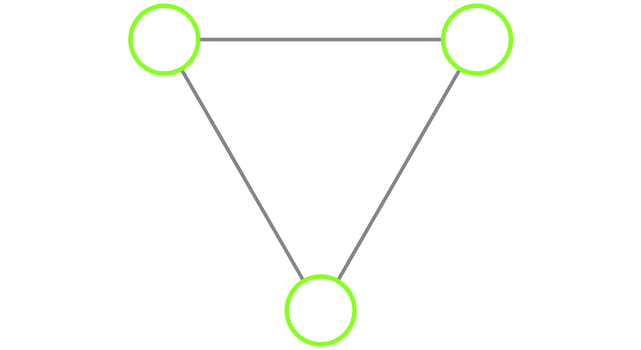
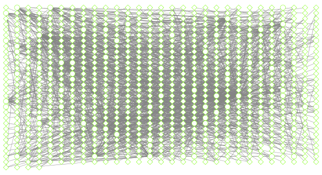
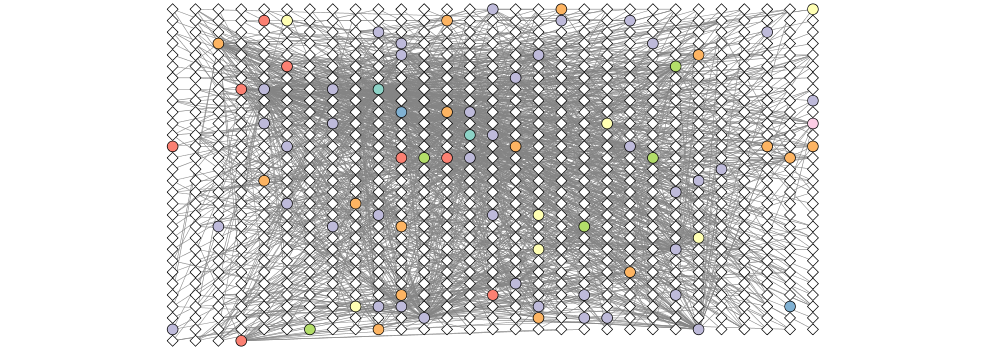

```{r setup, include=FALSE}
knitr::opts_chunk$set(echo = TRUE)
```

```{r, Warnings = FALSE}
source("https://bioconductor.org/biocLite.R")
biocLite("RCy3")
```

```{r}
library(RCy3)
library(igraph)
library(RColorBrewer)
```

```{r, Warnings = FALSE}
cwd <- demoSimpleGraph()
```

```{r}
layoutNetwork(cwd, 'force-directed')

#other possible layouts
possible.layout.names <- getLayoutNames(cwd)
layoutNetwork(cwd, possible.layout.names[1])

#Test connection to Cytoscape
ping(cwd)
```

```{r}
saveImage(cwd,
          file.name="demo", 
          image.type = "png", 
          h=350)
```


```{r}

#only call a certain function from the package we need "::"
```

##Switch Styles

```{r}
setVisualStyle(cwd, "Marquee")
```

```{r}
saveImage(cwd, 
          file.name= "demo_marquee",
          image.type = "png", 
          h = 350)


```

What other styles are available? 
```{r}
styles <- getVisualStyleNames(cwd)
styles
```

```{r}
prok_vir_cor <- read.delim("virus_prok_cor_abundant.tsv")
head(prok_vir_cor)
```

```{r}
g <- graph.data.frame(prok_vir_cor, directed = FALSE)
```

check the class of the new object
```{r}
class(g)
g
```

Other common igraph functions are...
```{r}
#graph_from_data_frame()
#graph_from_edgelist()
#graph_from_adjacency_matrix()
```

```{r}
plot(g)
```

```{r}
plot(g, vertex.label = NA)
#remove blue text labels
```

```{r}
plot(g, vertex.size = 3, vertex.label = NA)
#make the nodes smaller
```

Query the vertex and edge attributes
```{r}
V(g)

E(g)
```

## Network community detection

```{r}
cb <- cluster_edge_betweenness(g)
cb
```

Plot it

```{r}
plot(cb, y=g, vertex.label = NA, vertex.size = 3)
```

Extract cluster/community membership vector for further inspection with 'membership()' function

```{r}
head( membership(cb))
```

##Node degree

degree of node calculation
```{r}
d <- degree(g)
hist(d, breaks = 30, col = "lightblue", main = "Node Degree Distribution")
```

```{r}
plot (degree_distribution(g), type = "h")
```

##Centrality analysis 

Which nodes are most important?

```{r}
pr <- page_rank(g)
head(pr$vector)
```

Let network with nodes scaled vias this page rank centrality score

```{r}
# Make a size vector btwn 2 and 20 for node plotting size
install.packages("BBmisc")
library(BBmisc)
v.size <- BBmisc::normalize(pr$vector, range=c(2,20), method="range")
plot(g, vertex.size=v.size, vertex.label=NA)
```

```{r}
v.size <- BBmisc::normalize(d, range=c(2,20), method="range")
plot(g, vertex.size=v.size, vertex.label=NA)
#centrality score in degree
```

```{r}
b <- betweenness(g)
v.size <- BBmisc::normalize(b, range=c(2,20), method="range")
plot(g, vertex.size=v.size, vertex.label=NA)
#centrality score for betweenness
```


##Read taxonomic classification for network annotation

```{r}
phage_id_affiliation <- read.delim("phage_ids_with_affiliation.tsv")
head(phage_id_affiliation)
```

```{r}
bac_id_affi <- read.delim("prok_tax_from_silva.tsv", stringsAsFactors = FALSE)
head(bac_id_affi)

```

```{r}
#Extract our vertex names
genenet.nodes <- as.data.frame(vertex.attributes(g), stringsAsFactors = FALSE)
head(genenet.nodes)
```

How many phage entries do we have?
```{r}
length( grep("^ph_", genenet.nodes[,1]))
```

Now lets merge these with the annotation data

```{r}
# We dont need all annotation data so lets make a reduced table 'z' for merging
z <- bac_id_affi[,c("Accession_ID", "Kingdom", "Phylum", "Class")]
n <- merge(genenet.nodes, z, by.x="name", by.y="Accession_ID", all.x=TRUE)
head(n)
```

```{r}
#check on the column names before merging
colnames(n)
```

```{r}
colnames(phage_id_affiliation)
```

```{r}
# Again we only need a subset of `phage_id_affiliation` for our purposes
y <- phage_id_affiliation[, c("first_sheet.Phage_id_network", "phage_affiliation","Tax_order", "Tax_subfamily")]

# Add the little phage annotation that we have
x <- merge(x=n, y=y, by.x="name", by.y="first_sheet.Phage_id_network", all.x=TRUE)

## Remove duplicates from multiple matches
x <- x[!duplicated( (x$name) ),]
head(x)
```

```{r}
#save merged annotation results back to the object
genenet.nodes <- x
```


Add data related to the connections between organisms, the edge data, and then prepare to send nodes and edges to cytoscape using 'cyPlot()'
```{r}
genenet.edges <- data.frame(igraph::as_edgelist(g))
names(genenet.edges) <- c("name.1",
                          "name.2")
genenet.edges$Weight <- igraph::edge_attr(g)[[1]]

genenet.edges$name.1 <- as.character(genenet.edges$name.1)
genenet.edges$name.2 <- as.character(genenet.edges$name.2)
genenet.nodes$name <- as.character(genenet.nodes$name)

ug <- cyPlot(genenet.nodes,genenet.edges)
```

## Send network to Cytoscape using RCy3

Create a connection from R to Cytoscape

```{r}
# Open a new connection and delete any existing windows/networks in Cy
cy <- CytoscapeConnection()
deleteAllWindows(cy)
```

A new network window has been created, but with no graph
```{r}
cw <- CytoscapeWindow("Tara oceans",
                      graph = ug,
                      overwriteWindow = TRUE)
```

```{r}
displayGraph(cw)
layoutNetwork(cw)
fitContent(cw)
```

##Color network by prokaryotic phylum

```{r}
families_to_colour <- unique(genenet.nodes$Phylum)
families_to_colour <- families_to_colour[!is.na(families_to_colour)]

node.colour <- RColorBrewer::brewer.pal(length(families_to_colour), "Set3")
```

Now to add some color 
```{r}
setNodeColorRule(cw,
                 "Phylum",
                 families_to_colour,
                 node.colour,
                 "lookup",
                 default.color = "#ffffff")

```

Take a pic

```{r}
saveImage(cw,
          file.name="net2",
          image.type="png",
          h=350)
```

```{r}
library(knitr)

```

## Set node shape to reflect virus or prokaryote
```{r}
#Change shape of the nodes
shapes_for_nodes <- c("DIAMOND")

phage_names <- grep("ph_",
                    genenet.nodes$name,
                    value = TRUE)
setNodeShapeRule(cw,
                 "label",
                 phage_names,
                 shapes_for_nodes)
```

```{r}
displayGraph(cw)
fitContent(cw)
```

color viral family nodes
```{r}
setDefaultNodeBorderWidth(cw, 5)
families_to_colour <- c("Podoviridae",
                        "Siphoviridae",
                        "Myoviridae")

node.colour <- RColorBrewer::brewer.pal(length(families_to_colour),
                          "Dark2")
setNodeBorderColorRule(cw,
                       "Tax_subfamily",
                       families_to_colour,
                       node.colour,
                       "lookup", 
                       default.color = "#000000")
```

```{r}
displayGraph(cw)
fitContent(cw)
```

```{r}
saveImage(cw,
          "co-occur2",
          "png",
          h=350)

```

```{r}
getLayoutNames(cw)
```

```{r}
getLayoutPropertyNames(cw, layout.name="force-directed")

```

```{r}
getLayoutPropertyValue(cw, "force-directed", "defaultSpringLength")
```

```{r}
getLayoutPropertyValue(cw, "force-directed", "numIterations")  

```

```{r}
layoutNetwork(cw, layout.name = "force-directed")
fitContent(cw)
```


##Look at network properties

```{r}
## initiate a new node attribute
ug2 <- initNodeAttribute(graph = ug,
                          "degree",
                          "numeric",
                          0.0) 

## Use the igraph to calculate degree from the original graph
nodeData(ug2, nodes(ug2), "degree") <- igraph::degree(g)

cw2 <- CytoscapeWindow("Tara oceans with degree",
                      graph = ug2,
                      overwriteWindow = TRUE)
```

```{r}
displayGraph(cw2)
layoutNetwork(cw2)
```

##Size by degree 

```{r}

degree_control_points <- c(min(igraph::degree(g)),
                           mean(igraph::degree(g)),
                           max(igraph::degree(g)))
node_sizes <- c(20,
                20,
                80,
                100,
                110) # number of control points in interpolation mode,
                     # the first and the last are for sizes "below" and "above" the attribute seen.

setNodeSizeRule(cw,
                "degree",
                degree_control_points,
                node_sizes,
                mode = "interpolate")
```

```{r}
layoutNetwork(cw2,
              "force-directed")
```

