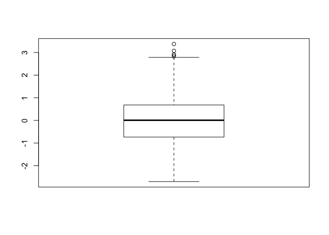
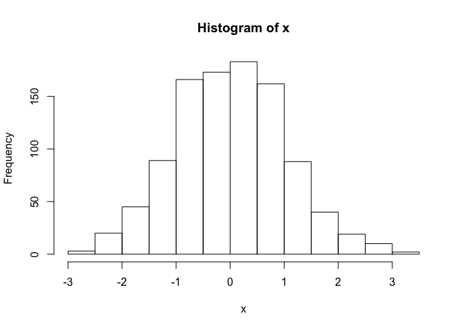
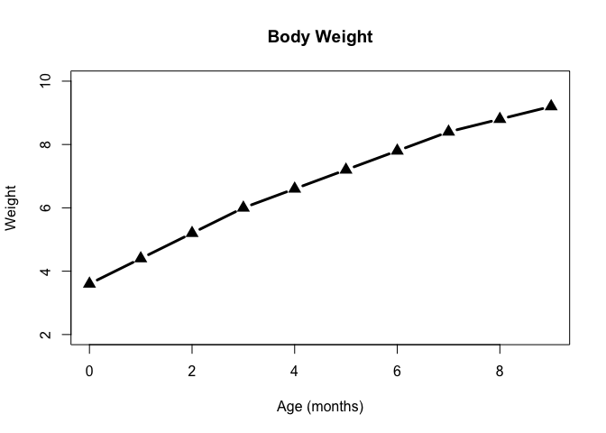
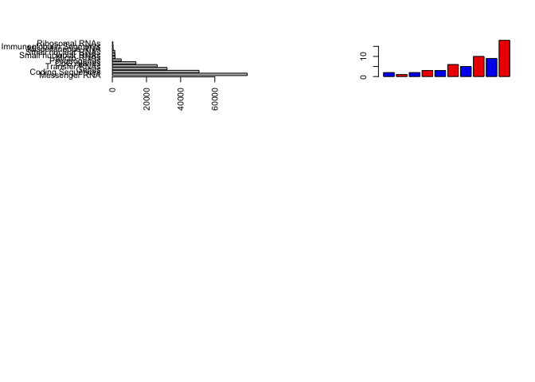
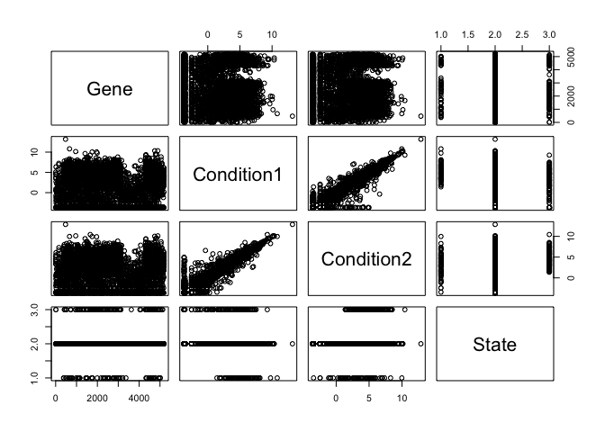
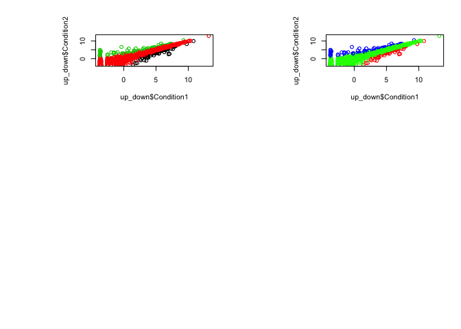

```r
#Bioinformatics Class 5
# Plots 

x <- rnorm(1000, 0)
#normal distribution where (1000 is number of observations, 0 is the mean)

mean(x)
```

```
## [1] 0.01012544
```

```r
sd(x)
```

```
## [1] 1.026271
```

```r
#mean and standard deviation functions 

summary (x)
```

```
##      Min.   1st Qu.    Median      Mean   3rd Qu.      Max. 
## -2.701116 -0.735499  0.007403  0.010125  0.682470  3.373825
```

```r
#Tukey summary statistics (minimum, quartiles (Q2=median; IQR Q3-Q2 represents 50% of data), and maximum)

boxplot(x)
```

<!-- -->

```r
#See the data as a graph- see the shape of the data

hist(x)
```

<!-- -->

```r
#histogram

baby <- read.table("bggn213_05_rstats/weight_chart.txt", header = TRUE)
#requires file name, use the " to denote character, input as directory
#HEADER=FALSE- names of the variables as the first line

View(baby)
#comes up in a new tab

plot(baby, type= "b", pch= 17, cex= 1.5, lwd= 3, ylim= c(2,10), xlab= "Age (months)", main= "Body Weight")
```

<!-- -->

```r
#type "p" point, "l" lines, "b" both
#... can call other functions inside (par function)
#par search within topic
#lwd - line width
#ylim- changes limits of axis
#xlab- axis label
#main title

#Section 1.B
feat <- read.table("bggn213_05_rstats/feature_counts.txt", sep="\t", header = TRUE)
#read table and attribute tab delimiter

View(feat)
is.data.frame(feat)
```

```
## [1] TRUE
```

```r
is.matrix(feat)
```

```
## [1] FALSE
```

```r
#what format?

par(mar=c(5,11,4,2))
barplot(feat$Count, names.arg = feat$Feature, horiz = TRUE, las=2)
#mar c(bottom, left, top, right)
par( mfrow= c(3,2))
barplot(feat$Count, names.arg = feat$Feature, horiz = TRUE, las=2)
#par( mfrow= c(rows,cols)) then plot 

mfcount <- read.delim("bggn213_05_rstats/male_female_counts.txt")
#read delimited table
View(mfcount)

barplot(mfcount$Count, col = c("blue2", "red2"))
#mfcount would complain it's a datafield; add $ and gives variables
#vector of colors will be recycled after the number given


mycols <- rainbow(nrow(mfcount))
length(mycols)
```

```
## [1] 10
```

```r
#???

up_down <- read.delim("bggn213_05_rstats/up_down_expression.txt")
View(up_down)

plot(up_down)
```

<!-- --><!-- -->

```r
plot(up_down$Condition1, up_down$Condition2, col = up_down$State)
#plot(up_[2:3]) does the same- calling by row
#color by the column state
#default colors by number 1=black, 2=red, 3=green

unique(up_down$State)
```

```
## [1] unchanging up         down      
## Levels: down unchanging up
```

```r
table(up_down$State)
```

```
## 
##       down unchanging         up 
##         72       4997        127
```

```r
#which/how many unique states there are- colored differently
#how many genes were changed in expression

levels(up_down$State)
```

```
## [1] "down"       "unchanging" "up"
```

```r
palette(c("red", "green", "blue"))
plot(up_down$Condition1, up_down$Condition2, col=up_down$State)
#assign levels to the state and colors will be distributed to the correct state
#run source to run the whole script. If there are no errors, then press the compile report as html
```

<!-- -->


---
title: "plots_class5.R"
author: "mandialker"
date: "Fri May  4 15:26:37 2018"
---
