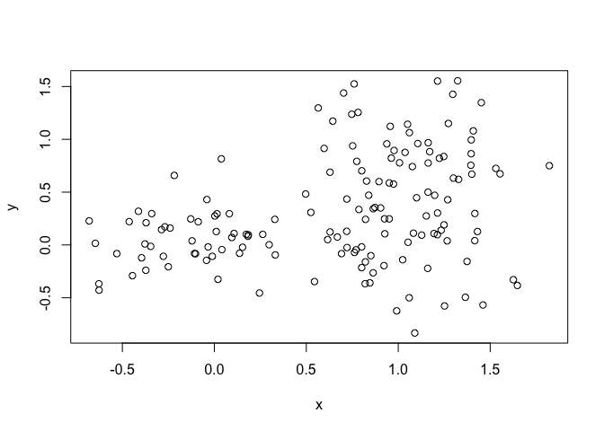
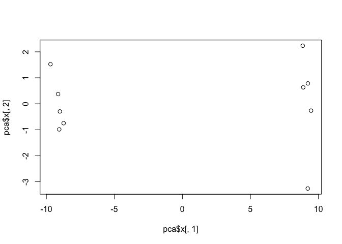
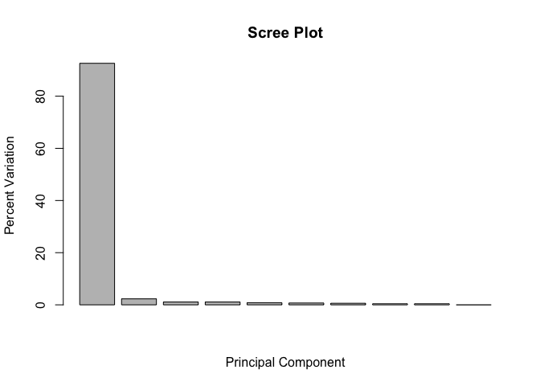
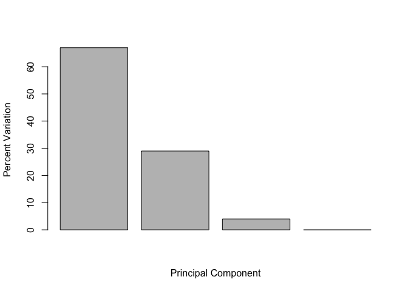

## K-means clustering example

Lets make up some data for testing the kmeans() function. 

```r
#two groupings of points, one centered at 3,-3
#cbind will turn our two datasets into columns and plot the temp and reverse temp 
tmp <- c(rnorm(30,-3), rnorm(30,3))
x <- cbind(x=tmp, y=rev(tmp))
plot(x)
```

<!-- -->


```r
km <- kmeans(x, centers = 2, nstart = 20)
km
```

```
## K-means clustering with 2 clusters of sizes 30, 30
## 
## Cluster means:
##           x         y
## 1  3.058666 -3.197317
## 2 -3.197317  3.058666
## 
## Clustering vector:
##  [1] 2 2 2 2 2 2 2 2 2 2 2 2 2 2 2 2 2 2 2 2 2 2 2 2 2 2 2 2 2 2 1 1 1 1 1
## [36] 1 1 1 1 1 1 1 1 1 1 1 1 1 1 1 1 1 1 1 1 1 1 1 1 1
## 
## Within cluster sum of squares by cluster:
## [1] 51.23217 51.23217
##  (between_SS / total_SS =  92.0 %)
## 
## Available components:
## 
## [1] "cluster"      "centers"      "totss"        "withinss"    
## [5] "tot.withinss" "betweenss"    "size"         "iter"        
## [9] "ifault"
```

```r
#km gives list of 9 things, can specify which 
```

Use the kmeans() function setting k to 2 and nstart=20
Inspect/print the results

Q. How many points are in each cluster?
print km or will be in the global environment

Q. What ‘component’ of your result object details
 - cluster size?
 
 

```r
# km$size
```

 - cluster assignment/membership?


```r
# km$cluster
```
 
 - cluster center?


```r
# km$centers
```
 
Plot x colored by the kmeans cluster assignment and
 add cluster centers as blue points
 

```r
plot(x, col= km$cluster, pch = 16)
points(km$centers, col = "blue", pch = 15)
```

<!-- -->


##Hierarchical clustering

# First we need to calculate point (dis)similarity
# as the Euclidean distance between observations


```r
dist_matrix <- dist(x)
```

# The hclust() function returns a hierarchical
# clustering model

```r
hc <- hclust(d = dist_matrix)
# the print method is not so useful here- view only works as data.frames 
#pairwise distances 60x60 for how many objects 
hc 
```

```
## 
## Call:
## hclust(d = dist_matrix)
## 
## Cluster method   : complete 
## Distance         : euclidean 
## Number of objects: 60
```


```r
View(as.matrix(dist_matrix))
dim(as.matrix(dist_matrix))
```

```
## [1] 60 60
```

convert to matrix to see the structure of the distance matrix and find the dimensions 

plot the clustering 


```r
plot(hc)
```

<!-- -->

```r
#split into two clusters and along the x
#lenght shows the degree of dissimilarity- more length = more disimilar
```

Use abline to draw the line at the height of where you want to split the tree


```r
plot(hc)
abline(h=6, col = "red")
```

<!-- -->


Lets cut our tree to define our clusters 


```r
grps <- cutree(hc, k = 2)
table(grps)
```

```
## grps
##  1  2 
## 30 30
```


```r
plot(x, col = grps )
```

<!-- -->


# Step 1. Generate some example data for clustering

```r
x <- rbind(
 matrix(rnorm(100, mean=0, sd = 0.3), ncol = 2), # c1
 matrix(rnorm(100, mean = 1, sd = 0.3), ncol = 2), # c2
 matrix(c(rnorm(50, mean = 1, sd = 0.3), # c3
 rnorm(50, mean = 0, sd = 0.3)), ncol = 2))
colnames(x) <- c("x", "y")
```

# Step 2. Plot the data without clustering


```r
plot(x)
```

<!-- -->

# Step 3. Generate colors for known clusters
# (just so we can compare to hclust results)

```r
col <- as.factor( rep(c("c1","c2","c3"), each=50) )
plot(x, col=col)
```

<!-- -->


```r
distmatrix <- dist(x)
```


```r
hc <- hclust(distmatrix)
plot(hc)
```

<!-- -->

Lets cut into 3 groups 

```r
grps <- cutree(hc, k=3)
table(grps)
```

```
## grps
##  1  2  3 
## 85 54 11
```

Plot the data colored by cluster

```r
plot(x, col = grps)
```

<!-- -->


##Principal Component Analysis (PCA)

Import the data 

```r
mydata <- read.csv("https://tinyurl.com/expression-CSV",
 row.names=1)
head(mydata)
```

```
##        wt1 wt2  wt3  wt4 wt5 ko1 ko2 ko3 ko4 ko5
## gene1  439 458  408  429 420  90  88  86  90  93
## gene2  219 200  204  210 187 427 423 434 433 426
## gene3 1006 989 1030 1017 973 252 237 238 226 210
## gene4  783 792  829  856 760 849 856 835 885 894
## gene5  181 249  204  244 225 277 305 272 270 279
## gene6  460 502  491  491 493 612 594 577 618 638
```

Lets do the PCA

```r
#need to transpose the data to run this analysis, because the function is old and they expect the rows and columns to be switched
#t(mydata)
pca <- prcomp(t(mydata), scale = TRUE)

#see what is returned by the prcomp() function
attributes(pca)
```

```
## $names
## [1] "sdev"     "rotation" "center"   "scale"    "x"       
## 
## $class
## [1] "prcomp"
```

## A basic PC1 vs PC2 2-D plot


```r
#calling the columns [ ,#]
plot(pca$x[,1], pca$x[,2]) 
```

<!-- -->

This provides the percentage that accounts for the variance or amount of data that is explained by the variable

```r
## Variance captured per PC
pca.var <- pca$sdev^2 
pca.var.per <- round(pca.var/sum(pca.var)*100, 1) 
pca.var.per
```

```
##  [1] 92.6  2.3  1.1  1.1  0.8  0.7  0.6  0.4  0.4  0.0
```


Now we create the barplot for the vector of numbers 

```r
barplot(pca.var.per, main="Scree Plot",
 xlab="Principal Component", ylab="Percent Variation")
```

<!-- -->

Now let's make this a little more useful and color the PCA plot


```r
## A vector of colors for wt and ko samples
#substr uses the x input, 1, 2 are the characters it wants to look at 
colvec <- as.factor( substr( colnames(mydata), 1, 2) )

plot(pca$x[,1], pca$x[,2], col=colvec, pch=16,
 xlab=paste0("PC1 (", pca.var.per[1], "%)"),
 ylab=paste0("PC2 (", pca.var.per[2], "%)")) 

#label all points with text() function
text(pca$x[,1], pca$x[,2], (labels = colnames(mydata)))
```

<!-- -->

```r
# OR
#identify(pca$x[,1], pca$x[,2], labels = colnames(mydata))
#allows you to click on things with a crosshair 
```


##Another Example

UK foods dataset


```r
#pay attention to the directory
x <- read.csv("/Users/mandialker/downloads/UK_foods.csv")
dim(x)
```

```
## [1] 17  5
```

look at the header

```r
head(x)
```

```
##                X England Wales Scotland N.Ireland
## 1         Cheese     105   103      103        66
## 2  Carcass_meat      245   227      242       267
## 3    Other_meat      685   803      750       586
## 4           Fish     147   160      122        93
## 5 Fats_and_oils      193   235      184       209
## 6         Sugars     156   175      147       139
```

change the rownames 

```r
rownames(x) <- x[,1]
#watch out for the numbers in the first column from last time. Shift the column names over by one 
x <- x[,-1]
head(x)
```

```
##                England Wales Scotland N.Ireland
## Cheese             105   103      103        66
## Carcass_meat       245   227      242       267
## Other_meat         685   803      750       586
## Fish               147   160      122        93
## Fats_and_oils      193   235      184       209
## Sugars             156   175      147       139
```


```r
dim(x)
```

```
## [1] 17  4
```


```r
View(x)
knitr::kable(x, caption="The full UK foods data table")
```


Table: The full UK foods data table

                      England   Wales   Scotland   N.Ireland
-------------------  --------  ------  ---------  ----------
Cheese                    105     103        103          66
Carcass_meat              245     227        242         267
Other_meat                685     803        750         586
Fish                      147     160        122          93
Fats_and_oils             193     235        184         209
Sugars                    156     175        147         139
Fresh_potatoes            720     874        566        1033
Fresh_Veg                 253     265        171         143
Other_Veg                 488     570        418         355
Processed_potatoes        198     203        220         187
Processed_Veg             360     365        337         334
Fresh_fruit              1102    1137        957         674
Cereals                  1472    1582       1462        1494
Beverages                  57      73         53          47
Soft_drinks              1374    1256       1572        1506
Alcoholic_drinks          375     475        458         135
Confectionery              54      64         62          41

Visualize with a heatmap

```r
#par(mar=c(20, 4, 4, 2))
heatmap(as.matrix(x))
```

<!-- -->

Time for the PCA!!

```r
pca <- prcomp( t(x) )
summary(pca)
```

```
## Importance of components:
##                             PC1      PC2      PC3       PC4
## Standard deviation     324.1502 212.7478 73.87622 4.189e-14
## Proportion of Variance   0.6744   0.2905  0.03503 0.000e+00
## Cumulative Proportion    0.6744   0.9650  1.00000 1.000e+00
```

Plot the PCA and assign the y and y labels

```r
#xlim gives you the axis min and max
plot(pca$x[,1], pca$x[,2], xlab="PC1", ylab="PC2", xlim=c(-270,500))
text(pca$x[,1], pca$x[,2], colnames(x))
```

<!-- -->

Now let's calculate the percentages 

```r
v <- round( pca$sdev^2/sum(pca$sdev^2) * 100 )
v
```

```
## [1] 67 29  4  0
```


```r
z <- summary(pca)
z$importance
```

```
##                              PC1       PC2      PC3          PC4
## Standard deviation     324.15019 212.74780 73.87622 4.188568e-14
## Proportion of Variance   0.67444   0.29052  0.03503 0.000000e+00
## Cumulative Proportion    0.67444   0.96497  1.00000 1.000000e+00
```

This data can be summarized in a barplot 

```r
barplot(v, xlab="Principal Component", ylab="Percent Variation")
```

<!-- -->


```r
cumsum(v)
```

```
## [1]  67  96 100 100
```


```r
## Lets focus on PC1 as it accounts for > 90% of variance 
par(mar=c(10, 4, 4, 2))
barplot( pca$rotation[,1], las=2 )
```

<!-- -->


```r
## Or the inbuilt biplot() can be useful too 
biplot(pca)
```

<!-- -->

