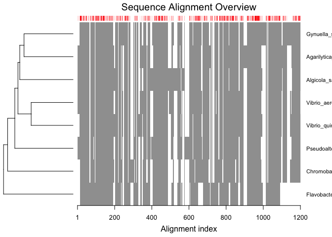
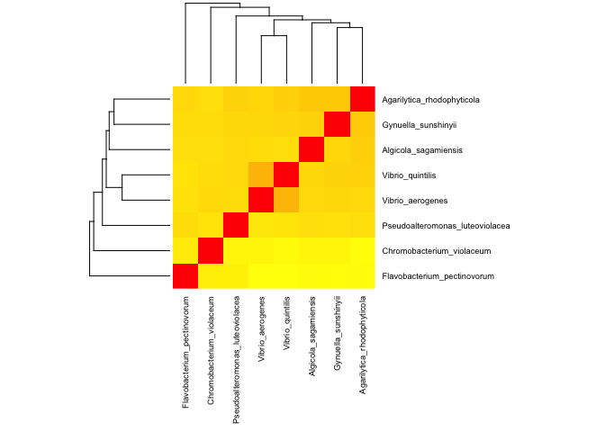
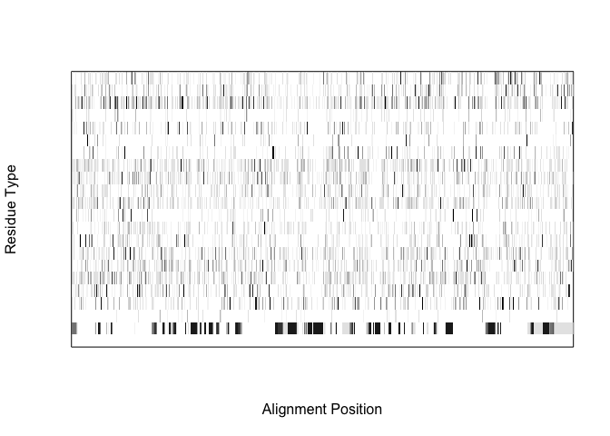
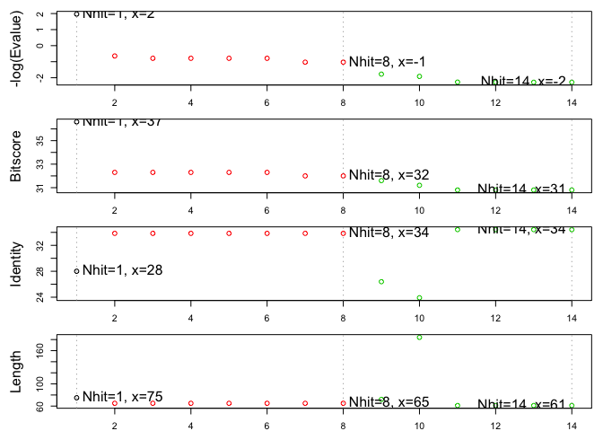

##Making a heatmap with sequence similarity

I've chosen the protein 'WP_086931707' as the top hit for my gene of interest. I searched for similar sequences using BLASTp with a nr database. A multiple sequence alignment was performed using MUSCLE, and a phylogenetic tree was created using a distance-matrix.


```r
library(bio3d)
```

Let's start by importing the data


```r
alignment <- read.fasta("agarilytica_alignment.fa.txt")
#import the data
```

If we want to plot it and check it out really quick...


```r
plot.fasta(alignment)
```

<!-- -->

Awesome, so theres some conservation! Let's make this quantifiable. 


```r
seq_id_matr <- seqidentity(alignment)
seq_id_matr
```

```
##                                 Flavobacterium_pectinovorum
## Flavobacterium_pectinovorum                           1.000
## Chromobacterium_violaceum                             0.202
## Pseudoalteromonas_luteoviolacea                       0.261
## Vibrio_quintilis                                      0.236
## Vibrio_aerogenes                                      0.237
## Algicola_sagamiensis                                  0.247
## Agarilytica_rhodophyticola                            0.272
## Gynuella_sunshinyii                                   0.258
##                                 Chromobacterium_violaceum
## Flavobacterium_pectinovorum                         0.202
## Chromobacterium_violaceum                           1.000
## Pseudoalteromonas_luteoviolacea                     0.249
## Vibrio_quintilis                                    0.271
## Vibrio_aerogenes                                    0.283
## Algicola_sagamiensis                                0.263
## Agarilytica_rhodophyticola                          0.265
## Gynuella_sunshinyii                                 0.278
##                                 Pseudoalteromonas_luteoviolacea
## Flavobacterium_pectinovorum                               0.261
## Chromobacterium_violaceum                                 0.249
## Pseudoalteromonas_luteoviolacea                           1.000
## Vibrio_quintilis                                          0.346
## Vibrio_aerogenes                                          0.331
## Algicola_sagamiensis                                      0.345
## Agarilytica_rhodophyticola                                0.370
## Gynuella_sunshinyii                                       0.350
##                                 Vibrio_quintilis Vibrio_aerogenes
## Flavobacterium_pectinovorum                0.236            0.237
## Chromobacterium_violaceum                  0.271            0.283
## Pseudoalteromonas_luteoviolacea            0.346            0.331
## Vibrio_quintilis                           1.000            0.519
## Vibrio_aerogenes                           0.519            1.000
## Algicola_sagamiensis                       0.369            0.367
## Agarilytica_rhodophyticola                 0.418            0.390
## Gynuella_sunshinyii                        0.399            0.385
##                                 Algicola_sagamiensis
## Flavobacterium_pectinovorum                    0.247
## Chromobacterium_violaceum                      0.263
## Pseudoalteromonas_luteoviolacea                0.345
## Vibrio_quintilis                               0.369
## Vibrio_aerogenes                               0.367
## Algicola_sagamiensis                           1.000
## Agarilytica_rhodophyticola                     0.423
## Gynuella_sunshinyii                            0.388
##                                 Agarilytica_rhodophyticola
## Flavobacterium_pectinovorum                          0.272
## Chromobacterium_violaceum                            0.265
## Pseudoalteromonas_luteoviolacea                      0.370
## Vibrio_quintilis                                     0.418
## Vibrio_aerogenes                                     0.390
## Algicola_sagamiensis                                 0.423
## Agarilytica_rhodophyticola                           1.000
## Gynuella_sunshinyii                                  0.437
##                                 Gynuella_sunshinyii
## Flavobacterium_pectinovorum                   0.258
## Chromobacterium_violaceum                     0.278
## Pseudoalteromonas_luteoviolacea               0.350
## Vibrio_quintilis                              0.399
## Vibrio_aerogenes                              0.385
## Algicola_sagamiensis                          0.388
## Agarilytica_rhodophyticola                    0.437
## Gynuella_sunshinyii                           1.000
```

##Let's try to plot it as a heatmap


```r
library(RColorBrewer)
```

First, let's use the function we worked on in class 'map.colors()'


```r
x <- as.matrix(seq_id_matr)
x
```

```
##                                 Flavobacterium_pectinovorum
## Flavobacterium_pectinovorum                           1.000
## Chromobacterium_violaceum                             0.202
## Pseudoalteromonas_luteoviolacea                       0.261
## Vibrio_quintilis                                      0.236
## Vibrio_aerogenes                                      0.237
## Algicola_sagamiensis                                  0.247
## Agarilytica_rhodophyticola                            0.272
## Gynuella_sunshinyii                                   0.258
##                                 Chromobacterium_violaceum
## Flavobacterium_pectinovorum                         0.202
## Chromobacterium_violaceum                           1.000
## Pseudoalteromonas_luteoviolacea                     0.249
## Vibrio_quintilis                                    0.271
## Vibrio_aerogenes                                    0.283
## Algicola_sagamiensis                                0.263
## Agarilytica_rhodophyticola                          0.265
## Gynuella_sunshinyii                                 0.278
##                                 Pseudoalteromonas_luteoviolacea
## Flavobacterium_pectinovorum                               0.261
## Chromobacterium_violaceum                                 0.249
## Pseudoalteromonas_luteoviolacea                           1.000
## Vibrio_quintilis                                          0.346
## Vibrio_aerogenes                                          0.331
## Algicola_sagamiensis                                      0.345
## Agarilytica_rhodophyticola                                0.370
## Gynuella_sunshinyii                                       0.350
##                                 Vibrio_quintilis Vibrio_aerogenes
## Flavobacterium_pectinovorum                0.236            0.237
## Chromobacterium_violaceum                  0.271            0.283
## Pseudoalteromonas_luteoviolacea            0.346            0.331
## Vibrio_quintilis                           1.000            0.519
## Vibrio_aerogenes                           0.519            1.000
## Algicola_sagamiensis                       0.369            0.367
## Agarilytica_rhodophyticola                 0.418            0.390
## Gynuella_sunshinyii                        0.399            0.385
##                                 Algicola_sagamiensis
## Flavobacterium_pectinovorum                    0.247
## Chromobacterium_violaceum                      0.263
## Pseudoalteromonas_luteoviolacea                0.345
## Vibrio_quintilis                               0.369
## Vibrio_aerogenes                               0.367
## Algicola_sagamiensis                           1.000
## Agarilytica_rhodophyticola                     0.423
## Gynuella_sunshinyii                            0.388
##                                 Agarilytica_rhodophyticola
## Flavobacterium_pectinovorum                          0.272
## Chromobacterium_violaceum                            0.265
## Pseudoalteromonas_luteoviolacea                      0.370
## Vibrio_quintilis                                     0.418
## Vibrio_aerogenes                                     0.390
## Algicola_sagamiensis                                 0.423
## Agarilytica_rhodophyticola                           1.000
## Gynuella_sunshinyii                                  0.437
##                                 Gynuella_sunshinyii
## Flavobacterium_pectinovorum                   0.258
## Chromobacterium_violaceum                     0.278
## Pseudoalteromonas_luteoviolacea               0.350
## Vibrio_quintilis                              0.399
## Vibrio_aerogenes                              0.385
## Algicola_sagamiensis                          0.388
## Agarilytica_rhodophyticola                    0.437
## Gynuella_sunshinyii                           1.000
```


```r
# map.colors <- function (x, 
#                          high.low = range(x) , 
#                          palette = heat.colors(100)) {
#   
#   #determine where in the 'high.low' range our values of 'x' lie
#   percent <- ((x - high.low[1]) / (high.low[2] - high.low[1]))
#   
#   #Where in the 'palette' vector of colors is this 'percent' 
#   # note catch for 0 percent values to 1
#   index <- round ((length(palette) - 1) * percent) + 1
#   
#   return (palette[index])
# }
# mycols <-map.colors(x)
# #make my colors object, 'mycols' with your data as the palette input
# mycols
```


```r
#head(col_breaks)
```


```r
#my_palette <- colorRampPalette(c(rgb(0,0,1,1), rgb(0,0,1,0)), alpha = TRUE)(16)
#col_breaks = c(seq(0, 0.53,length=8),  # for blue
#  seq(0.90,1,length=1))           # for cyan
```


```r
#quantile.range <- quantile(seq_id_matr, probs = seq(0, 1, 0.01))
#palette.breaks <- seq(quantile.range["5%"], quantile.range["95%"], 0.01)
 
# use http://colorbrewer2.org/ to find optimal divergent color palette (or set own)
#color.palette  <- colorRampPalette(c("#FC8D59", "#FFFFBF", "#91CF60"))(length(palette.breaks) - 1)
```


```r
my_palette <- colorRampPalette(c("yellow", "orange", "red"))(n = 1000)
col_breaks = c(seq(0, 0.100,length=200),  # for yellow
               seq(0.101,.499,length=800), #for orange
               seq(.500, 1, length= 1)) #for red
#created a palette using colorRampPalette
#made color breaks based on the way I wanted to represent the colors
```


```r
heatmap(seq_id_matr, scale = "column", col = my_palette, margins = c(10, 10), cexRow = .7, cexCol = .7)
```

<!-- -->

```r
#Need to assign colors, add labels- maybe a column with color gradient?
```


```r
# png("~/Desktop/bootcamp/R/bggn213_github/findagene/heatmap.png",    # create PNG for the heat map        
# width = 5*300,        # 5 x 300 pixels
# height = 5*300,
# res = 300,            # 300 pixels per inch
# pointsize = 8)        # smaller font size
```

##Search for protein in PDB


```r
consenseq <- consensus(alignment, cutoff = 0.6)
#Get the consensus sequence from the alignment
```


```r
# Plot residue frequency matrix
png(filename = "freq.png", width = 1500, height = 780)
col <- mono.colors(32)
aa  <- rev(rownames(consenseq$freq))
```


```r
image(x=1:ncol(consenseq$freq),
      y=1:nrow(consenseq$freq),
      z=as.matrix(rev(as.data.frame(t(consenseq$freq)))),
      col=col, yaxt="n", xaxt="n",
      xlab="Alignment Position", ylab="Residue Type")
```

<!-- -->

Let's determine the most similar sequence for the consensus


```r
rowSums(seq_id_matr)
```

```
##     Flavobacterium_pectinovorum       Chromobacterium_violaceum 
##                           2.713                           2.811 
## Pseudoalteromonas_luteoviolacea                Vibrio_quintilis 
##                           3.252                           3.558 
##                Vibrio_aerogenes            Algicola_sagamiensis 
##                           3.512                           3.402 
##      Agarilytica_rhodophyticola             Gynuella_sunshinyii 
##                           3.575                           3.495
```

Looks like we will be using Agarlytica

Lets get the sequence 

```r
fasta <- get.seq("WP_086931707", outfile = "seqs.fasta", db = "nr")
```

```
## Warning in get.seq("WP_086931707", outfile = "seqs.fasta", db = "nr"):
## Removing existing file: seqs.fasta
```

```r
fasta
```

```
##                  1        .         .         .         .         .         60 
## WP_086931707.1   MAQSDQSLILLTQHTNGTTQTSRNLPQLTHQYFSAQERSLAEWFHYMYLFSKNIGFFDYT
##                  1        .         .         .         .         .         60 
## 
##                 61        .         .         .         .         .         120 
## WP_086931707.1   KQQQNGSWQGALANIEQARLFTHLIEGTEVDEDTRNLISRPDMGLLLAFFEMLNTPQQQF
##                 61        .         .         .         .         .         120 
## 
##                121        .         .         .         .         .         180 
## WP_086931707.1   DGFTARHKEFYYRQVLGFKEKPALADKVHVVITLSDSTSSKTLIRGTQFDGGEDQDGRKL
##                121        .         .         .         .         .         180 
## 
##                181        .         .         .         .         .         240 
## WP_086931707.1   IYQSLNNAVLNHSQVNKLFTLSKKPIDPNNQKNRLLLTQAYNREQGLEFSPEGILSFGEA
##                181        .         .         .         .         .         240 
## 
##                241        .         .         .         .         .         300 
## WP_086931707.1   DINDGERQLSPSLGFTLASPELYLSSGERRIMLAFRLKENHSWIGGSISDYFDVSISTEQ
##                241        .         .         .         .         .         300 
## 
##                301        .         .         .         .         .         360 
## WP_086931707.1   ELITLDIELTEEFVTYLDSNNTLQESLNITITIDRFFPVIAPLLDENQPLIPILPYLSFT
##                301        .         .         .         .         .         360 
## 
##                361        .         .         .         .         .         420 
## WP_086931707.1   LKEQHHDKLELLSRGNFINIDMTIQVSGLSGAIASNDIGAIDTSKPFEPFTFSPSISSSF
##                361        .         .         .         .         .         420 
## 
##                421        .         .         .         .         .         480 
## WP_086931707.1   NFTHPELLIKNITQASLDFHWLGRPSNLREHYDSYAEYRDPDKNESAIWAPNLAQVCYSD
##                421        .         .         .         .         .         480 
## 
##                481        .         .         .         .         .         540 
## WP_086931707.1   KPDCIENLTLFSDNEPVNNIDRMAMGFISQETNYQKLRQEYFQLPFTSNSAVEWPRWFSI
##                481        .         .         .         .         .         540 
## 
##                541        .         .         .         .         .         600 
## WP_086931707.1   TLSNNDFGHGDYSQVAQYIAYKNINNPDAENTLVPPPYTPVLNQLLINYESHTQLTLTDT
##                541        .         .         .         .         .         600 
## 
##                601        .         .         .         .         .         660 
## WP_086931707.1   LLESPESKKYRRALQHIHPLGRPNMSATNSKHIALVPNFTKQGYLYIGVANVKTPGQFRL
##                601        .         .         .         .         .         660 
## 
##                661        .         .         .         .         .         720 
## WP_086931707.1   YFQLDPVDGSNISNDPILEWSYLDSSGWTAFSRSQGGRVAQRGRIIEDSTFNLLDSGIVA
##                661        .         .         .         .         .         720 
## 
##                721        .         .         .         .         .         780 
## WP_086931707.1   FELPKLDLSSNFTGDDLLWIRVSISDDDAAADNVAKYSQIKNVLAQGIMLELMHLPIDQA
##                721        .         .         .         .         .         780 
## 
##                781        .         .         .         .         .         840 
## WP_086931707.1   LLDEQASVSSNVPKYYHPSHYAEPLSQESISSLLQPDSQIAAISQPYGSFSGKQSETSDT
##                781        .         .         .         .         .         840 
## 
##                841        .         .         .         .         .         900 
## WP_086931707.1   LEIRASERLRHKNRALTAWDFEHLVLAEFPELFMARCYRNNTQDSVDLVVVPVNYDPTIL
##                841        .         .         .         .         .         900 
## 
##                901        .         .         .         .         .         960 
## WP_086931707.1   QPKVPLFLKRRIQRFLNTISPPGVNVQVIDPEYEEVAFDVTLNIAQDYDLDSTVLDVNQI
##                901        .         .         .         .         .         960 
## 
##                961        .         .         .         .         .         1020 
## WP_086931707.1   LIDFMTPWNRRAENNTEQKNQSFVKTIYLTEVAAALERHPGVKVIYTLRAQVKKVFQDIS
##                961        .         .         .         .         .         1020 
## 
##               1021        .         .         .         .      1067 
## WP_086931707.1   LIPSSNAAILVPVADHKISLLNKEVEIFEGIGKWKIEDDFEIPNKTP
##               1021        .         .         .         .      1067 
## 
## Call:
##   read.fasta(file = outfile)
## 
## Class:
##   fasta
## 
## Alignment dimensions:
##   1 sequence rows; 1067 position columns (1067 non-gap, 0 gap) 
## 
## + attr: id, ali, call
```

Retrieve the alignment sequence

```r
pdbseq <- fasta$ali
pdbseq
```

```
##                [,1] [,2] [,3] [,4] [,5] [,6] [,7] [,8] [,9] [,10] [,11]
## WP_086931707.1 "M"  "A"  "Q"  "S"  "D"  "Q"  "S"  "L"  "I"  "L"   "L"  
##                [,12] [,13] [,14] [,15] [,16] [,17] [,18] [,19] [,20] [,21]
## WP_086931707.1 "T"   "Q"   "H"   "T"   "N"   "G"   "T"   "T"   "Q"   "T"  
##                [,22] [,23] [,24] [,25] [,26] [,27] [,28] [,29] [,30] [,31]
## WP_086931707.1 "S"   "R"   "N"   "L"   "P"   "Q"   "L"   "T"   "H"   "Q"  
##                [,32] [,33] [,34] [,35] [,36] [,37] [,38] [,39] [,40] [,41]
## WP_086931707.1 "Y"   "F"   "S"   "A"   "Q"   "E"   "R"   "S"   "L"   "A"  
##                [,42] [,43] [,44] [,45] [,46] [,47] [,48] [,49] [,50] [,51]
## WP_086931707.1 "E"   "W"   "F"   "H"   "Y"   "M"   "Y"   "L"   "F"   "S"  
##                [,52] [,53] [,54] [,55] [,56] [,57] [,58] [,59] [,60] [,61]
## WP_086931707.1 "K"   "N"   "I"   "G"   "F"   "F"   "D"   "Y"   "T"   "K"  
##                [,62] [,63] [,64] [,65] [,66] [,67] [,68] [,69] [,70] [,71]
## WP_086931707.1 "Q"   "Q"   "Q"   "N"   "G"   "S"   "W"   "Q"   "G"   "A"  
##                [,72] [,73] [,74] [,75] [,76] [,77] [,78] [,79] [,80] [,81]
## WP_086931707.1 "L"   "A"   "N"   "I"   "E"   "Q"   "A"   "R"   "L"   "F"  
##                [,82] [,83] [,84] [,85] [,86] [,87] [,88] [,89] [,90] [,91]
## WP_086931707.1 "T"   "H"   "L"   "I"   "E"   "G"   "T"   "E"   "V"   "D"  
##                [,92] [,93] [,94] [,95] [,96] [,97] [,98] [,99] [,100]
## WP_086931707.1 "E"   "D"   "T"   "R"   "N"   "L"   "I"   "S"   "R"   
##                [,101] [,102] [,103] [,104] [,105] [,106] [,107] [,108]
## WP_086931707.1 "P"    "D"    "M"    "G"    "L"    "L"    "L"    "A"   
##                [,109] [,110] [,111] [,112] [,113] [,114] [,115] [,116]
## WP_086931707.1 "F"    "F"    "E"    "M"    "L"    "N"    "T"    "P"   
##                [,117] [,118] [,119] [,120] [,121] [,122] [,123] [,124]
## WP_086931707.1 "Q"    "Q"    "Q"    "F"    "D"    "G"    "F"    "T"   
##                [,125] [,126] [,127] [,128] [,129] [,130] [,131] [,132]
## WP_086931707.1 "A"    "R"    "H"    "K"    "E"    "F"    "Y"    "Y"   
##                [,133] [,134] [,135] [,136] [,137] [,138] [,139] [,140]
## WP_086931707.1 "R"    "Q"    "V"    "L"    "G"    "F"    "K"    "E"   
##                [,141] [,142] [,143] [,144] [,145] [,146] [,147] [,148]
## WP_086931707.1 "K"    "P"    "A"    "L"    "A"    "D"    "K"    "V"   
##                [,149] [,150] [,151] [,152] [,153] [,154] [,155] [,156]
## WP_086931707.1 "H"    "V"    "V"    "I"    "T"    "L"    "S"    "D"   
##                [,157] [,158] [,159] [,160] [,161] [,162] [,163] [,164]
## WP_086931707.1 "S"    "T"    "S"    "S"    "K"    "T"    "L"    "I"   
##                [,165] [,166] [,167] [,168] [,169] [,170] [,171] [,172]
## WP_086931707.1 "R"    "G"    "T"    "Q"    "F"    "D"    "G"    "G"   
##                [,173] [,174] [,175] [,176] [,177] [,178] [,179] [,180]
## WP_086931707.1 "E"    "D"    "Q"    "D"    "G"    "R"    "K"    "L"   
##                [,181] [,182] [,183] [,184] [,185] [,186] [,187] [,188]
## WP_086931707.1 "I"    "Y"    "Q"    "S"    "L"    "N"    "N"    "A"   
##                [,189] [,190] [,191] [,192] [,193] [,194] [,195] [,196]
## WP_086931707.1 "V"    "L"    "N"    "H"    "S"    "Q"    "V"    "N"   
##                [,197] [,198] [,199] [,200] [,201] [,202] [,203] [,204]
## WP_086931707.1 "K"    "L"    "F"    "T"    "L"    "S"    "K"    "K"   
##                [,205] [,206] [,207] [,208] [,209] [,210] [,211] [,212]
## WP_086931707.1 "P"    "I"    "D"    "P"    "N"    "N"    "Q"    "K"   
##                [,213] [,214] [,215] [,216] [,217] [,218] [,219] [,220]
## WP_086931707.1 "N"    "R"    "L"    "L"    "L"    "T"    "Q"    "A"   
##                [,221] [,222] [,223] [,224] [,225] [,226] [,227] [,228]
## WP_086931707.1 "Y"    "N"    "R"    "E"    "Q"    "G"    "L"    "E"   
##                [,229] [,230] [,231] [,232] [,233] [,234] [,235] [,236]
## WP_086931707.1 "F"    "S"    "P"    "E"    "G"    "I"    "L"    "S"   
##                [,237] [,238] [,239] [,240] [,241] [,242] [,243] [,244]
## WP_086931707.1 "F"    "G"    "E"    "A"    "D"    "I"    "N"    "D"   
##                [,245] [,246] [,247] [,248] [,249] [,250] [,251] [,252]
## WP_086931707.1 "G"    "E"    "R"    "Q"    "L"    "S"    "P"    "S"   
##                [,253] [,254] [,255] [,256] [,257] [,258] [,259] [,260]
## WP_086931707.1 "L"    "G"    "F"    "T"    "L"    "A"    "S"    "P"   
##                [,261] [,262] [,263] [,264] [,265] [,266] [,267] [,268]
## WP_086931707.1 "E"    "L"    "Y"    "L"    "S"    "S"    "G"    "E"   
##                [,269] [,270] [,271] [,272] [,273] [,274] [,275] [,276]
## WP_086931707.1 "R"    "R"    "I"    "M"    "L"    "A"    "F"    "R"   
##                [,277] [,278] [,279] [,280] [,281] [,282] [,283] [,284]
## WP_086931707.1 "L"    "K"    "E"    "N"    "H"    "S"    "W"    "I"   
##                [,285] [,286] [,287] [,288] [,289] [,290] [,291] [,292]
## WP_086931707.1 "G"    "G"    "S"    "I"    "S"    "D"    "Y"    "F"   
##                [,293] [,294] [,295] [,296] [,297] [,298] [,299] [,300]
## WP_086931707.1 "D"    "V"    "S"    "I"    "S"    "T"    "E"    "Q"   
##                [,301] [,302] [,303] [,304] [,305] [,306] [,307] [,308]
## WP_086931707.1 "E"    "L"    "I"    "T"    "L"    "D"    "I"    "E"   
##                [,309] [,310] [,311] [,312] [,313] [,314] [,315] [,316]
## WP_086931707.1 "L"    "T"    "E"    "E"    "F"    "V"    "T"    "Y"   
##                [,317] [,318] [,319] [,320] [,321] [,322] [,323] [,324]
## WP_086931707.1 "L"    "D"    "S"    "N"    "N"    "T"    "L"    "Q"   
##                [,325] [,326] [,327] [,328] [,329] [,330] [,331] [,332]
## WP_086931707.1 "E"    "S"    "L"    "N"    "I"    "T"    "I"    "T"   
##                [,333] [,334] [,335] [,336] [,337] [,338] [,339] [,340]
## WP_086931707.1 "I"    "D"    "R"    "F"    "F"    "P"    "V"    "I"   
##                [,341] [,342] [,343] [,344] [,345] [,346] [,347] [,348]
## WP_086931707.1 "A"    "P"    "L"    "L"    "D"    "E"    "N"    "Q"   
##                [,349] [,350] [,351] [,352] [,353] [,354] [,355] [,356]
## WP_086931707.1 "P"    "L"    "I"    "P"    "I"    "L"    "P"    "Y"   
##                [,357] [,358] [,359] [,360] [,361] [,362] [,363] [,364]
## WP_086931707.1 "L"    "S"    "F"    "T"    "L"    "K"    "E"    "Q"   
##                [,365] [,366] [,367] [,368] [,369] [,370] [,371] [,372]
## WP_086931707.1 "H"    "H"    "D"    "K"    "L"    "E"    "L"    "L"   
##                [,373] [,374] [,375] [,376] [,377] [,378] [,379] [,380]
## WP_086931707.1 "S"    "R"    "G"    "N"    "F"    "I"    "N"    "I"   
##                [,381] [,382] [,383] [,384] [,385] [,386] [,387] [,388]
## WP_086931707.1 "D"    "M"    "T"    "I"    "Q"    "V"    "S"    "G"   
##                [,389] [,390] [,391] [,392] [,393] [,394] [,395] [,396]
## WP_086931707.1 "L"    "S"    "G"    "A"    "I"    "A"    "S"    "N"   
##                [,397] [,398] [,399] [,400] [,401] [,402] [,403] [,404]
## WP_086931707.1 "D"    "I"    "G"    "A"    "I"    "D"    "T"    "S"   
##                [,405] [,406] [,407] [,408] [,409] [,410] [,411] [,412]
## WP_086931707.1 "K"    "P"    "F"    "E"    "P"    "F"    "T"    "F"   
##                [,413] [,414] [,415] [,416] [,417] [,418] [,419] [,420]
## WP_086931707.1 "S"    "P"    "S"    "I"    "S"    "S"    "S"    "F"   
##                [,421] [,422] [,423] [,424] [,425] [,426] [,427] [,428]
## WP_086931707.1 "N"    "F"    "T"    "H"    "P"    "E"    "L"    "L"   
##                [,429] [,430] [,431] [,432] [,433] [,434] [,435] [,436]
## WP_086931707.1 "I"    "K"    "N"    "I"    "T"    "Q"    "A"    "S"   
##                [,437] [,438] [,439] [,440] [,441] [,442] [,443] [,444]
## WP_086931707.1 "L"    "D"    "F"    "H"    "W"    "L"    "G"    "R"   
##                [,445] [,446] [,447] [,448] [,449] [,450] [,451] [,452]
## WP_086931707.1 "P"    "S"    "N"    "L"    "R"    "E"    "H"    "Y"   
##                [,453] [,454] [,455] [,456] [,457] [,458] [,459] [,460]
## WP_086931707.1 "D"    "S"    "Y"    "A"    "E"    "Y"    "R"    "D"   
##                [,461] [,462] [,463] [,464] [,465] [,466] [,467] [,468]
## WP_086931707.1 "P"    "D"    "K"    "N"    "E"    "S"    "A"    "I"   
##                [,469] [,470] [,471] [,472] [,473] [,474] [,475] [,476]
## WP_086931707.1 "W"    "A"    "P"    "N"    "L"    "A"    "Q"    "V"   
##                [,477] [,478] [,479] [,480] [,481] [,482] [,483] [,484]
## WP_086931707.1 "C"    "Y"    "S"    "D"    "K"    "P"    "D"    "C"   
##                [,485] [,486] [,487] [,488] [,489] [,490] [,491] [,492]
## WP_086931707.1 "I"    "E"    "N"    "L"    "T"    "L"    "F"    "S"   
##                [,493] [,494] [,495] [,496] [,497] [,498] [,499] [,500]
## WP_086931707.1 "D"    "N"    "E"    "P"    "V"    "N"    "N"    "I"   
##                [,501] [,502] [,503] [,504] [,505] [,506] [,507] [,508]
## WP_086931707.1 "D"    "R"    "M"    "A"    "M"    "G"    "F"    "I"   
##                [,509] [,510] [,511] [,512] [,513] [,514] [,515] [,516]
## WP_086931707.1 "S"    "Q"    "E"    "T"    "N"    "Y"    "Q"    "K"   
##                [,517] [,518] [,519] [,520] [,521] [,522] [,523] [,524]
## WP_086931707.1 "L"    "R"    "Q"    "E"    "Y"    "F"    "Q"    "L"   
##                [,525] [,526] [,527] [,528] [,529] [,530] [,531] [,532]
## WP_086931707.1 "P"    "F"    "T"    "S"    "N"    "S"    "A"    "V"   
##                [,533] [,534] [,535] [,536] [,537] [,538] [,539] [,540]
## WP_086931707.1 "E"    "W"    "P"    "R"    "W"    "F"    "S"    "I"   
##                [,541] [,542] [,543] [,544] [,545] [,546] [,547] [,548]
## WP_086931707.1 "T"    "L"    "S"    "N"    "N"    "D"    "F"    "G"   
##                [,549] [,550] [,551] [,552] [,553] [,554] [,555] [,556]
## WP_086931707.1 "H"    "G"    "D"    "Y"    "S"    "Q"    "V"    "A"   
##                [,557] [,558] [,559] [,560] [,561] [,562] [,563] [,564]
## WP_086931707.1 "Q"    "Y"    "I"    "A"    "Y"    "K"    "N"    "I"   
##                [,565] [,566] [,567] [,568] [,569] [,570] [,571] [,572]
## WP_086931707.1 "N"    "N"    "P"    "D"    "A"    "E"    "N"    "T"   
##                [,573] [,574] [,575] [,576] [,577] [,578] [,579] [,580]
## WP_086931707.1 "L"    "V"    "P"    "P"    "P"    "Y"    "T"    "P"   
##                [,581] [,582] [,583] [,584] [,585] [,586] [,587] [,588]
## WP_086931707.1 "V"    "L"    "N"    "Q"    "L"    "L"    "I"    "N"   
##                [,589] [,590] [,591] [,592] [,593] [,594] [,595] [,596]
## WP_086931707.1 "Y"    "E"    "S"    "H"    "T"    "Q"    "L"    "T"   
##                [,597] [,598] [,599] [,600] [,601] [,602] [,603] [,604]
## WP_086931707.1 "L"    "T"    "D"    "T"    "L"    "L"    "E"    "S"   
##                [,605] [,606] [,607] [,608] [,609] [,610] [,611] [,612]
## WP_086931707.1 "P"    "E"    "S"    "K"    "K"    "Y"    "R"    "R"   
##                [,613] [,614] [,615] [,616] [,617] [,618] [,619] [,620]
## WP_086931707.1 "A"    "L"    "Q"    "H"    "I"    "H"    "P"    "L"   
##                [,621] [,622] [,623] [,624] [,625] [,626] [,627] [,628]
## WP_086931707.1 "G"    "R"    "P"    "N"    "M"    "S"    "A"    "T"   
##                [,629] [,630] [,631] [,632] [,633] [,634] [,635] [,636]
## WP_086931707.1 "N"    "S"    "K"    "H"    "I"    "A"    "L"    "V"   
##                [,637] [,638] [,639] [,640] [,641] [,642] [,643] [,644]
## WP_086931707.1 "P"    "N"    "F"    "T"    "K"    "Q"    "G"    "Y"   
##                [,645] [,646] [,647] [,648] [,649] [,650] [,651] [,652]
## WP_086931707.1 "L"    "Y"    "I"    "G"    "V"    "A"    "N"    "V"   
##                [,653] [,654] [,655] [,656] [,657] [,658] [,659] [,660]
## WP_086931707.1 "K"    "T"    "P"    "G"    "Q"    "F"    "R"    "L"   
##                [,661] [,662] [,663] [,664] [,665] [,666] [,667] [,668]
## WP_086931707.1 "Y"    "F"    "Q"    "L"    "D"    "P"    "V"    "D"   
##                [,669] [,670] [,671] [,672] [,673] [,674] [,675] [,676]
## WP_086931707.1 "G"    "S"    "N"    "I"    "S"    "N"    "D"    "P"   
##                [,677] [,678] [,679] [,680] [,681] [,682] [,683] [,684]
## WP_086931707.1 "I"    "L"    "E"    "W"    "S"    "Y"    "L"    "D"   
##                [,685] [,686] [,687] [,688] [,689] [,690] [,691] [,692]
## WP_086931707.1 "S"    "S"    "G"    "W"    "T"    "A"    "F"    "S"   
##                [,693] [,694] [,695] [,696] [,697] [,698] [,699] [,700]
## WP_086931707.1 "R"    "S"    "Q"    "G"    "G"    "R"    "V"    "A"   
##                [,701] [,702] [,703] [,704] [,705] [,706] [,707] [,708]
## WP_086931707.1 "Q"    "R"    "G"    "R"    "I"    "I"    "E"    "D"   
##                [,709] [,710] [,711] [,712] [,713] [,714] [,715] [,716]
## WP_086931707.1 "S"    "T"    "F"    "N"    "L"    "L"    "D"    "S"   
##                [,717] [,718] [,719] [,720] [,721] [,722] [,723] [,724]
## WP_086931707.1 "G"    "I"    "V"    "A"    "F"    "E"    "L"    "P"   
##                [,725] [,726] [,727] [,728] [,729] [,730] [,731] [,732]
## WP_086931707.1 "K"    "L"    "D"    "L"    "S"    "S"    "N"    "F"   
##                [,733] [,734] [,735] [,736] [,737] [,738] [,739] [,740]
## WP_086931707.1 "T"    "G"    "D"    "D"    "L"    "L"    "W"    "I"   
##                [,741] [,742] [,743] [,744] [,745] [,746] [,747] [,748]
## WP_086931707.1 "R"    "V"    "S"    "I"    "S"    "D"    "D"    "D"   
##                [,749] [,750] [,751] [,752] [,753] [,754] [,755] [,756]
## WP_086931707.1 "A"    "A"    "A"    "D"    "N"    "V"    "A"    "K"   
##                [,757] [,758] [,759] [,760] [,761] [,762] [,763] [,764]
## WP_086931707.1 "Y"    "S"    "Q"    "I"    "K"    "N"    "V"    "L"   
##                [,765] [,766] [,767] [,768] [,769] [,770] [,771] [,772]
## WP_086931707.1 "A"    "Q"    "G"    "I"    "M"    "L"    "E"    "L"   
##                [,773] [,774] [,775] [,776] [,777] [,778] [,779] [,780]
## WP_086931707.1 "M"    "H"    "L"    "P"    "I"    "D"    "Q"    "A"   
##                [,781] [,782] [,783] [,784] [,785] [,786] [,787] [,788]
## WP_086931707.1 "L"    "L"    "D"    "E"    "Q"    "A"    "S"    "V"   
##                [,789] [,790] [,791] [,792] [,793] [,794] [,795] [,796]
## WP_086931707.1 "S"    "S"    "N"    "V"    "P"    "K"    "Y"    "Y"   
##                [,797] [,798] [,799] [,800] [,801] [,802] [,803] [,804]
## WP_086931707.1 "H"    "P"    "S"    "H"    "Y"    "A"    "E"    "P"   
##                [,805] [,806] [,807] [,808] [,809] [,810] [,811] [,812]
## WP_086931707.1 "L"    "S"    "Q"    "E"    "S"    "I"    "S"    "S"   
##                [,813] [,814] [,815] [,816] [,817] [,818] [,819] [,820]
## WP_086931707.1 "L"    "L"    "Q"    "P"    "D"    "S"    "Q"    "I"   
##                [,821] [,822] [,823] [,824] [,825] [,826] [,827] [,828]
## WP_086931707.1 "A"    "A"    "I"    "S"    "Q"    "P"    "Y"    "G"   
##                [,829] [,830] [,831] [,832] [,833] [,834] [,835] [,836]
## WP_086931707.1 "S"    "F"    "S"    "G"    "K"    "Q"    "S"    "E"   
##                [,837] [,838] [,839] [,840] [,841] [,842] [,843] [,844]
## WP_086931707.1 "T"    "S"    "D"    "T"    "L"    "E"    "I"    "R"   
##                [,845] [,846] [,847] [,848] [,849] [,850] [,851] [,852]
## WP_086931707.1 "A"    "S"    "E"    "R"    "L"    "R"    "H"    "K"   
##                [,853] [,854] [,855] [,856] [,857] [,858] [,859] [,860]
## WP_086931707.1 "N"    "R"    "A"    "L"    "T"    "A"    "W"    "D"   
##                [,861] [,862] [,863] [,864] [,865] [,866] [,867] [,868]
## WP_086931707.1 "F"    "E"    "H"    "L"    "V"    "L"    "A"    "E"   
##                [,869] [,870] [,871] [,872] [,873] [,874] [,875] [,876]
## WP_086931707.1 "F"    "P"    "E"    "L"    "F"    "M"    "A"    "R"   
##                [,877] [,878] [,879] [,880] [,881] [,882] [,883] [,884]
## WP_086931707.1 "C"    "Y"    "R"    "N"    "N"    "T"    "Q"    "D"   
##                [,885] [,886] [,887] [,888] [,889] [,890] [,891] [,892]
## WP_086931707.1 "S"    "V"    "D"    "L"    "V"    "V"    "V"    "P"   
##                [,893] [,894] [,895] [,896] [,897] [,898] [,899] [,900]
## WP_086931707.1 "V"    "N"    "Y"    "D"    "P"    "T"    "I"    "L"   
##                [,901] [,902] [,903] [,904] [,905] [,906] [,907] [,908]
## WP_086931707.1 "Q"    "P"    "K"    "V"    "P"    "L"    "F"    "L"   
##                [,909] [,910] [,911] [,912] [,913] [,914] [,915] [,916]
## WP_086931707.1 "K"    "R"    "R"    "I"    "Q"    "R"    "F"    "L"   
##                [,917] [,918] [,919] [,920] [,921] [,922] [,923] [,924]
## WP_086931707.1 "N"    "T"    "I"    "S"    "P"    "P"    "G"    "V"   
##                [,925] [,926] [,927] [,928] [,929] [,930] [,931] [,932]
## WP_086931707.1 "N"    "V"    "Q"    "V"    "I"    "D"    "P"    "E"   
##                [,933] [,934] [,935] [,936] [,937] [,938] [,939] [,940]
## WP_086931707.1 "Y"    "E"    "E"    "V"    "A"    "F"    "D"    "V"   
##                [,941] [,942] [,943] [,944] [,945] [,946] [,947] [,948]
## WP_086931707.1 "T"    "L"    "N"    "I"    "A"    "Q"    "D"    "Y"   
##                [,949] [,950] [,951] [,952] [,953] [,954] [,955] [,956]
## WP_086931707.1 "D"    "L"    "D"    "S"    "T"    "V"    "L"    "D"   
##                [,957] [,958] [,959] [,960] [,961] [,962] [,963] [,964]
## WP_086931707.1 "V"    "N"    "Q"    "I"    "L"    "I"    "D"    "F"   
##                [,965] [,966] [,967] [,968] [,969] [,970] [,971] [,972]
## WP_086931707.1 "M"    "T"    "P"    "W"    "N"    "R"    "R"    "A"   
##                [,973] [,974] [,975] [,976] [,977] [,978] [,979] [,980]
## WP_086931707.1 "E"    "N"    "N"    "T"    "E"    "Q"    "K"    "N"   
##                [,981] [,982] [,983] [,984] [,985] [,986] [,987] [,988]
## WP_086931707.1 "Q"    "S"    "F"    "V"    "K"    "T"    "I"    "Y"   
##                [,989] [,990] [,991] [,992] [,993] [,994] [,995] [,996]
## WP_086931707.1 "L"    "T"    "E"    "V"    "A"    "A"    "A"    "L"   
##                [,997] [,998] [,999] [,1000] [,1001] [,1002] [,1003]
## WP_086931707.1 "E"    "R"    "H"    "P"     "G"     "V"     "K"    
##                [,1004] [,1005] [,1006] [,1007] [,1008] [,1009] [,1010]
## WP_086931707.1 "V"     "I"     "Y"     "T"     "L"     "R"     "A"    
##                [,1011] [,1012] [,1013] [,1014] [,1015] [,1016] [,1017]
## WP_086931707.1 "Q"     "V"     "K"     "K"     "V"     "F"     "Q"    
##                [,1018] [,1019] [,1020] [,1021] [,1022] [,1023] [,1024]
## WP_086931707.1 "D"     "I"     "S"     "L"     "I"     "P"     "S"    
##                [,1025] [,1026] [,1027] [,1028] [,1029] [,1030] [,1031]
## WP_086931707.1 "S"     "N"     "A"     "A"     "I"     "L"     "V"    
##                [,1032] [,1033] [,1034] [,1035] [,1036] [,1037] [,1038]
## WP_086931707.1 "P"     "V"     "A"     "D"     "H"     "K"     "I"    
##                [,1039] [,1040] [,1041] [,1042] [,1043] [,1044] [,1045]
## WP_086931707.1 "S"     "L"     "L"     "N"     "K"     "E"     "V"    
##                [,1046] [,1047] [,1048] [,1049] [,1050] [,1051] [,1052]
## WP_086931707.1 "E"     "I"     "F"     "E"     "G"     "I"     "G"    
##                [,1053] [,1054] [,1055] [,1056] [,1057] [,1058] [,1059]
## WP_086931707.1 "K"     "W"     "K"     "I"     "E"     "D"     "D"    
##                [,1060] [,1061] [,1062] [,1063] [,1064] [,1065] [,1066]
## WP_086931707.1 "F"     "E"     "I"     "P"     "N"     "K"     "T"    
##                [,1067]
## WP_086931707.1 "P"
```

Now to run the blast against the pdb database


```r
pdb_hits <- blast.pdb(pdbseq[1,], database = "pdb")
```

```
##  Searching ... please wait (updates every 5 seconds) RID = HG8MJ2KV014 
##  .
##  Reporting 14 hits
```

Lets put this into a table, so we can start sorting through it 


```r
pdb_hit_table <- pdb_hits$hit.tbl
pdb_hit_table
```

```
##         queryid subjectids identity alignmentlength mismatches gapopens
## 1  Query_161517     4Q2W_A   28.000              75         44        2
## 2  Query_161517     1FR9_A   33.846              65         37        3
## 3  Query_161517     1E5K_A   33.846              65         37        3
## 4  Query_161517     1H4C_A   33.846              65         37        3
## 5  Query_161517     1H4E_A   33.846              65         37        3
## 6  Query_161517     1H4D_A   33.846              65         37        3
## 7  Query_161517     1HJJ_A   33.846              65         37        3
## 8  Query_161517     1HJL_A   33.846              65         37        3
## 9  Query_161517     6FI2_A   26.389              72         53        0
## 10 Query_161517     1DJ2_A   23.913             184        103        7
## 11 Query_161517     5KAH_A   34.426              61         39        1
## 12 Query_161517     2NP9_A   34.426              61         39        1
## 13 Query_161517     5KAG_A   34.426              61         39        1
## 14 Query_161517     5KAJ_A   34.426              61         39        1
##    q.start q.end s.start s.end evalue bitscore positives mlog.evalue
## 1      345   410      15    88   0.14     36.6     53.33   1.9661129
## 2      242   302     125   187   1.90     32.3     53.85  -0.6418539
## 3      242   302     125   187   2.20     32.3     53.85  -0.7884574
## 4      242   302     125   187   2.20     32.3     53.85  -0.7884574
## 5      242   302     125   187   2.20     32.3     53.85  -0.7884574
## 6      242   302     125   187   2.20     32.3     53.85  -0.7884574
## 7      242   302     125   187   2.80     32.0     52.31  -1.0296194
## 8      242   302     125   187   2.80     32.0     52.31  -1.0296194
## 9      538   609     244   315   5.90     31.6     48.61  -1.7749524
## 10      57   232      45   199   6.80     31.2     39.67  -1.9169226
## 11      77   136     358   418   9.70     30.8     47.54  -2.2721259
## 12      77   136     360   420   9.80     30.8     47.54  -2.2823824
## 13      77   136     358   418   9.80     30.8     47.54  -2.2823824
## 14      77   136     358   418   9.80     30.8     47.54  -2.2823824
##    pdb.id    acc
## 1  4Q2W_A 4Q2W_A
## 2  1FR9_A 1FR9_A
## 3  1E5K_A 1E5K_A
## 4  1H4C_A 1H4C_A
## 5  1H4E_A 1H4E_A
## 6  1H4D_A 1H4D_A
## 7  1HJJ_A 1HJJ_A
## 8  1HJL_A 1HJL_A
## 9  6FI2_A 6FI2_A
## 10 1DJ2_A 1DJ2_A
## 11 5KAH_A 5KAH_A
## 12 2NP9_A 2NP9_A
## 13 5KAG_A 5KAG_A
## 14 5KAJ_A 5KAJ_A
```


```r
plot.blast(pdb_hits)
```

```
##   * Possible cutoff values:    1 -2 -3 
##             Yielding Nhits:    1 8 14 
## 
##   * Chosen cutoff value of:    1 
##             Yielding Nhits:    1
```

<!-- -->

Why dont we annotate the IDs to see if the hits are interesting to us


```r
pdb_annotation_all <- pdb.annotate(pdb_hit_table$subjectids, anno.terms = c("structureId", "experimentalTechnique", "resolution", "source"), unique = TRUE)
```

```
## Warning in pdb.annotate(pdb_hit_table$subjectids, anno.terms =
## c("structureId", : ids should be standard 4 character PDB-IDs: trying first
## 4 characters...
```

Lets organize this data


```r
#3 unique hits 
#WARNING: Hits are not good for structure
unique_hits <- pdb_annotation_all[c(1,2,10), ]
unique_hits
```

```
##      structureId experimentalTechnique resolution                   source
## 4Q2W        4Q2W     X-RAY DIFFRACTION       1.65 Streptococcus pneumoniae
## 1FR9        1FR9     X-RAY DIFFRACTION       1.65         Escherichia coli
## 1DJ2        1DJ2     X-RAY DIFFRACTION        2.9     Arabidopsis thaliana
```

Now lets clean up our 'pdb_hit_table' 

```r
pdb_trimmed_hit_table <- pdb_hit_table[c(1,2,10), c("identity", "evalue")]
pdb_trimmed_hit_table
```

```
##    identity evalue
## 1    28.000   0.14
## 2    33.846   1.90
## 10   23.913   6.80
```


```r
unique_hits$evalue <- pdb_trimmed_hit_table$evalue
unique_hits$identity <- pdb_trimmed_hit_table$identity
unique_hits
```

```
##      structureId experimentalTechnique resolution                   source
## 4Q2W        4Q2W     X-RAY DIFFRACTION       1.65 Streptococcus pneumoniae
## 1FR9        1FR9     X-RAY DIFFRACTION       1.65         Escherichia coli
## 1DJ2        1DJ2     X-RAY DIFFRACTION        2.9     Arabidopsis thaliana
##      evalue identity
## 4Q2W   0.14   28.000
## 1FR9   1.90   33.846
## 1DJ2   6.80   23.913
```


```r
write.table(unique_hits, file = "pdb_results_table")
```


```r
pdb <- get.pdb("4Q2W")
```

```
## Warning in get.pdb("4Q2W"): ./4Q2W.pdb exists. Skipping download
```

